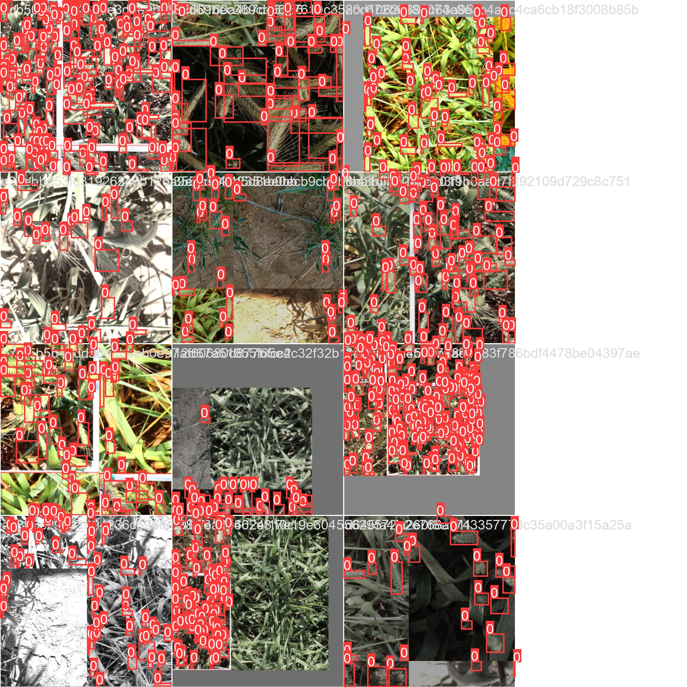
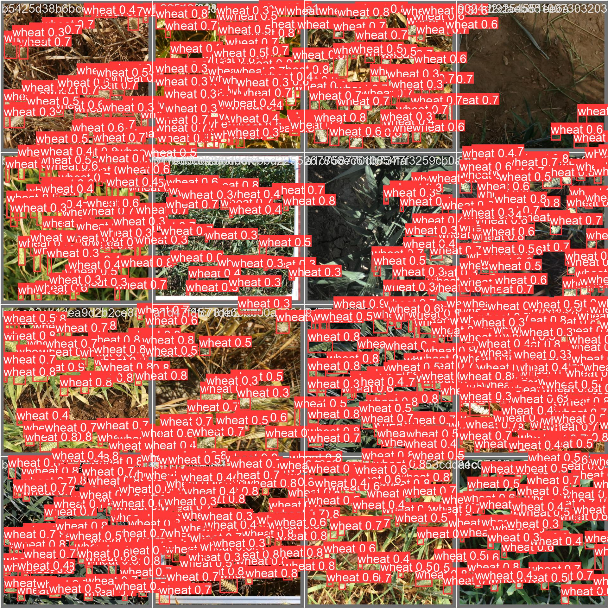
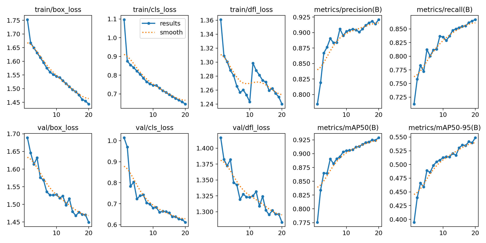
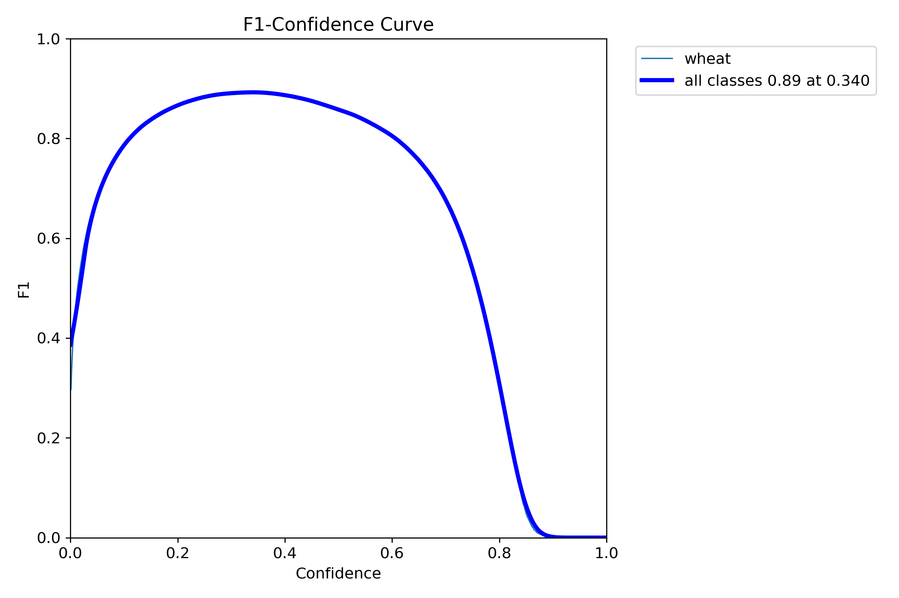
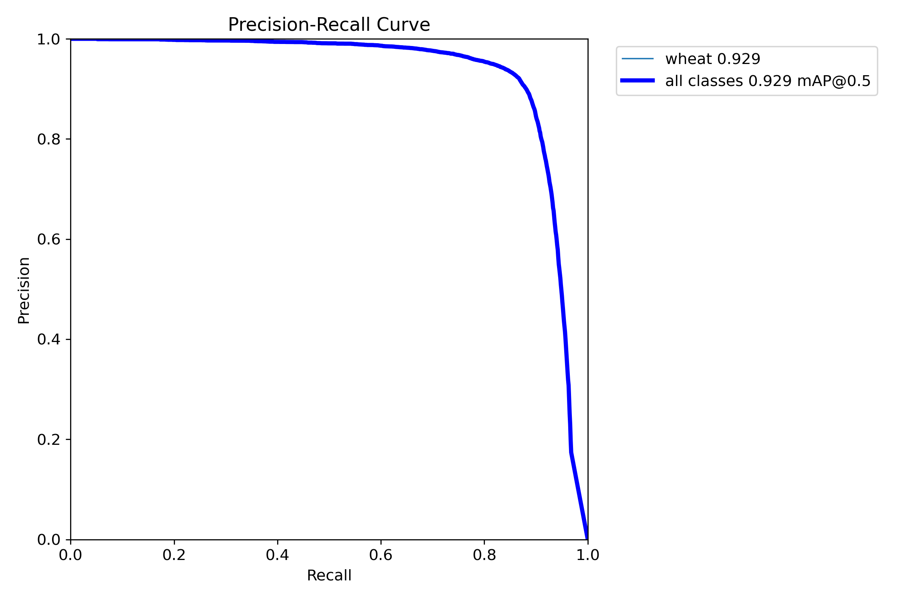
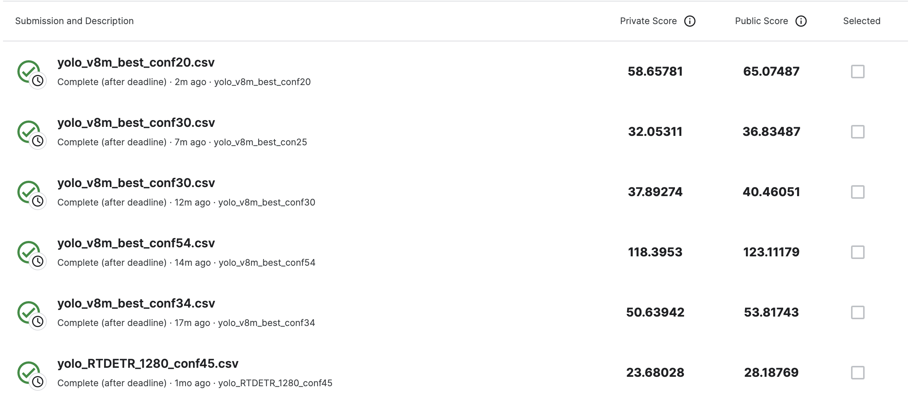

# wheat_head_counting
SuperAI SS3 : Hackaton Image processing (Detection) | Counting Wheat Head in Images

Train - จำนวน 4,558 รูป เเละ การระบุตำเเหน่งละชนิด 4,558 ไฟล์

Test - จำนวน 1,954 รูป

Metric : Mean Square Error

ที่มา :
ข้าวสาลีเป็นพื้นฐานของอาหารของมนุษย์ส่วนใหญ่ ดังนั้นธัญพืชนี้จึงได้รับการศึกษาอย่างกว้างขวางโดยนักวิทยาศาสตร์เพื่อความมั่นคงทางอาหาร โดยการตรวจสอบลักษณะทางสถาปัตยกรรมของพืชมีจุดประสงค์เพื่อช่วยให้ผู้เพาะพันธุ์พัฒนาได้ดีขึ้นและเกษตรกรตัดสินใจได้ดีขึ้น แต่ขั้นตอนที่สำคัญนี้ยังคงทำด้วยตนเอง เช่น การวัดลักษณะต่างๆ ของพืช หรือที่เรียกว่า Plant Phenotyping โดยวิธีการนี้อาศัยการนับรวงข้าว เพื่อระบุจำนวนความสมบูรณ์ขยายพันธุ์ ทำให้ใช้เวลานานในการนับเเละเป็นอุปสรรค์ในการวิจัย จึงนำเทคโนโลยี การนับรวงข้าวสาลีสามารถทำได้ด้วย Deep Learning อย่างไรก็ตาม งานนี้อาจท้าทายสายตา มักจะมีต้นข้าวสาลีหนาทึบซ้อนทับกัน และลมอาจทำให้ภาพถ่ายเบลอ ทำให้ระบุหัวเดี่ยวได้ยาก นอกจากนี้ รูปร่างหน้าตายังแตกต่างกันไปตามวุฒิภาวะ สี พันธุกรรม และทิศทางของศีรษะ ประการสุดท้าย เนื่องจากมีการปลูกข้าวสาลีทั่วโลก จึงต้องพิจารณาพันธุ์ ความหนาแน่นของการปลูก รูปแบบ และสภาพไร่ที่แตกต่างกัน หากต้องการยุติการนับด้วยตนเอง ต้องสร้างอัลกอริธึมการตรวจหาวัตถุที่มีประสิทธิภาพเพื่อแก้ไขปัญหาเหล่านี้ทั้งหมด โดยมีภารกิจ คือ การนับจำนวนหัวข้าวสาลีในแต่ละภาพ

Load Dataset >>> !kaggle competitions download -c wheat-head-for-superai-3

## Model - Yolo v8 (v8m & RTDETR)

